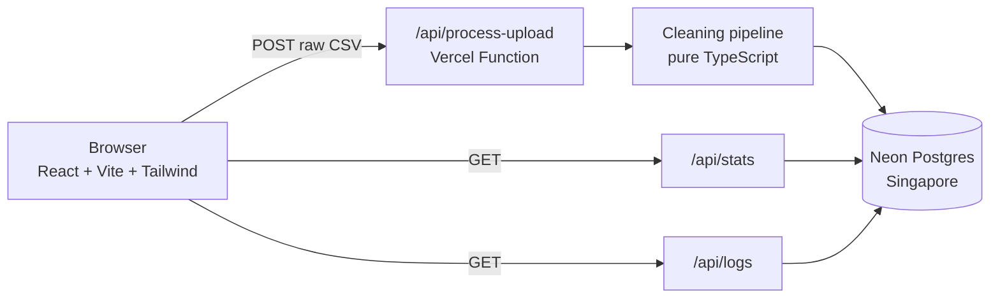
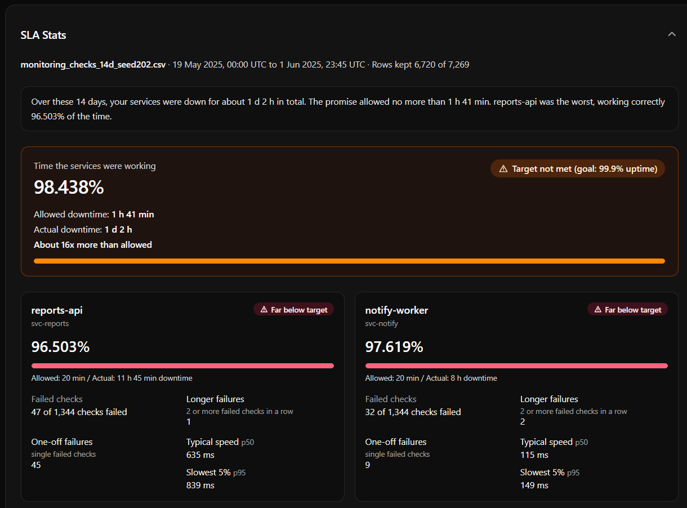
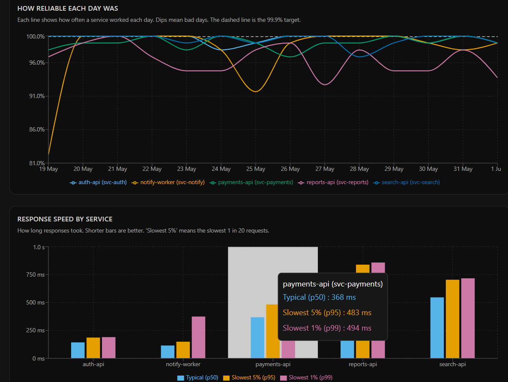
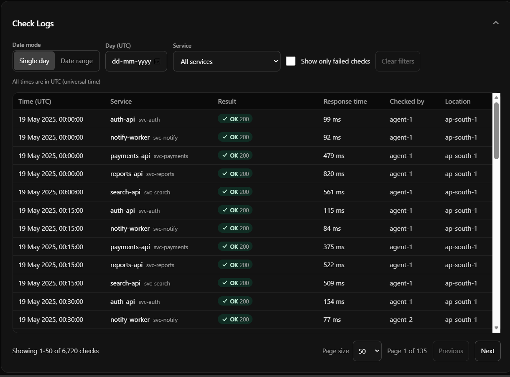

# NineWatch

**Turn messy uptime logs into trustworthy SLA numbers.**

NineWatch is a full-stack app that checks whether services kept their uptime promise (a 99.9% SLA). You upload a raw health-check CSV, a serverless function cleans and validates it, the clean data is stored in Postgres, and a one-page dashboard explains — in plain language — how reliable each service actually was.

**Live app:** https://nine-watch.vercel.app/
**Repo:** https://github.com/07Ankitha/NineWatch

**Last verified live:** <fill in the date you last checked it, e.g. "22 Sep 2026, by uploading a file end-to-end on the deployed URL">. The database is on a free tier and can pause after a period of inactivity; the first request after that will just take a little longer while it wakes up. See *Redeploying* below if it ever needs to be brought back up.

---

## What problem this solves

Cloud providers promise something like "99.9% uptime, or you get a refund." That number is normally calculated automatically from monitoring logs, with no human checking it. If the logs are messy — mixed time zones, mixed units, duplicated checks, a corrupt row here and there — the SLA number is wrong, and so is the refund.

NineWatch is that pipeline: **upload → clean → store → explain**, built so the numbers on the dashboard can be trusted.

---

## How it works

1. **Upload.** A CSV is sent as raw text to a serverless function.
2. **Clean.** The function parses it and fixes or removes known problems (see *Data findings* below), then reports exactly what it did.
3. **Store.** Clean rows are saved to Postgres in one transaction. Re-uploading the same file is detected by its hash and reuses the stored result instead of saving it twice.
4. **Explain.** The dashboard computes availability, downtime vs. the allowed budget, incidents, and speed, and states it in a plain-language summary before showing the details.
5. **Inspect.** A filterable, paginated table shows every individual check.

---

## Tech stack

| Layer | Choice | Why |
|---|---|---|
| Frontend | React + TypeScript (Vite), Tailwind CSS v4, Recharts | Fast to build and type-check; simple, readable charts. |
| Cloud function | Vercel Functions (TypeScript), region pinned to `sin1` (Singapore) | A real deployed serverless function on the free tier, kept close to the database to cut network latency. |
| Database | Neon Postgres (Singapore) | Standard Postgres on a free tier with no card required. Stats are computed with SQL views rather than in application code. |
| CSV parsing | PapaParse | Reliable parsing of messy CSVs. |
| Tests | Vitest | The cleaning and stats logic is written as pure functions, so it's straightforward to test. |
| Hosting | Vercel (frontend + functions), Neon (database) | Both free, both with public URLs, no servers to manage. |

---

## Architecture



### Database

Three tables plus five SQL views, created by numbered migrations in [`db/migrations`](db/migrations):

- **`uploads`** — one row per file: filename, a SHA-256 hash (so the same file is never processed twice), status, row counts, data period.
- **`checks`** — the clean records. A unique constraint on `(upload_id, service_id, checked_at)` means the database itself refuses duplicates, even if the application code has a bug.
- **`data_issues`** — every problem found in a file, with the original row and what was done about it.
- **Views** — `v_service_availability`, `v_outages`, `v_incidents`, `v_error_breakdown`, `v_daily_availability`. These do the SQL aggregation so the API stays a thin layer over the database.

### API

| Endpoint | Purpose |
|---|---|
| `POST /api/process-upload` | Body: raw CSV text, header `Content-Type: text/csv`, header `x-filename`. Cleans and saves the file inside one transaction, in batches. Returns a data-quality report. Re-uploading the same file returns the stored result instead of inserting again. |
| `GET /api/stats?uploadId=` | Availability per service, downtime vs. allowance, incidents, speed percentiles, error breakdown, daily trend. Defaults to the most recent upload. |
| `GET /api/logs` | Paginated check records. Filters: a single `date`, or `from`/`to` (both UTC calendar days, inclusive), a `service`, and `failuresOnly`. |

### Project layout

```
api/                 Vercel functions: process-upload, stats, logs
api/_lib/            Shared backend code: db, config, cleaning, uploads, stats, logs
db/migrations/       SQL: schema, stats views, incidents view
src/                 React app: upload, stats and logs components, formatting helpers
tests/               Vitest tests: cleaning, stats, logs, UI helpers
scripts/             upload-sample and verify-stats — development tools, not part of the deployed app
sample-data/         The five provided CSVs and the incident answer key
docs/                Notes and screenshots
```

---

## Data findings

I profiled all five provided files (9, 12, 14, 21 and 30 days) before writing any cleaning code. The same problems repeat in every file.

| Problem | How it shows up | What the code does |
|---|---|---|
| Duplicate checks | Exact copies, and the same check reported by `agent-1` and `agent-2` with slightly different latency | Keep one row per service and timestamp |
| Three timestamp formats | ISO with `Z`, 10-digit Unix seconds, and ISO with an offset like `+05:30` | Convert everything to UTC; an unreadable timestamp drops the row |
| Mixed latency units | `svc-search` reports in seconds, the other services in milliseconds | Convert seconds to milliseconds |
| Blank latency | About 1% of rows | Keep the check, leave latency empty |
| Impossible status code | Exactly one `999` row per file | Drop the row — it isn't a real HTTP status |
| Negative latency | Exactly one row per file | Keep the check, leave latency empty |
| Unsorted rows | Random order in the file | Sort by time, then service |
| Real 5xx errors | Many rows with 500 / 502 / 503 | Kept — these are real outages, not bad data |

### Verified cleaning results, per file

Produced by the automated integration test that runs the cleaner over all five sample files and checks that `kept + dropped = received` for each.

| File | Received | Kept | Removed | Duplicates removed | Invalid status | Negative latency | Missing latency | Seconds→ms conversions | Timezone offsets fixed | Unix times converted |
|---|---:|---:|---:|---:|---:|---:|---:|---:|---:|---:|
| 9 days | 4,672 | 4,319 | 353 | 352 | 1 | 1 | 56 | 853 | 29 | 65 |
| 12 days | 6,230 | 5,759 | 471 | 470 | 1 | 1 | 74 | 1,139 | 42 | 85 |
| 14 days | 7,269 | 6,720 | 549 | 548 | 1 | 1 | 87 | 1,327 | 49 | 103 |
| 21 days | 10,904 | 10,079 | 825 | 824 | 1 | 1 | 130 | 1,985 | 69 | 149 |
| 30 days | 15,577 | 14,399 | 1,178 | 1,177 | 1 | 1 | 186 | 2,847 | 104 | 214 |

`Removed = duplicates + the one invalid-status row` in every file, and `kept + removed` always equals `received`, so no row is lost silently.

### Two things worth calling out

- **The one status conflict was a corrupt row, not a genuine disagreement.** In the 14-day file, `svc-search` at `2025-05-31T11:00:00Z` appears twice: a `999` from one agent and a valid `200` from the other. The conflicting-duplicate rule (keep the failure when two agents disagree) is implemented and unit-tested, but here the invalid `999` row is dropped first during status validation, so by the time deduplication runs, only the valid `200` remains.
- **Every planted incident was detected, and a few extra ones weren't in the answer key.** Checked with `npm run verify:stats` against `sample-data/dataset_incident_log.json` (used only for this verification script — the app itself never reads it). Result: **0 missed incidents** across all five files. Four additional short incidents (30–45 minutes, 2–3 consecutive 5xx checks) also appear in the raw data and aren't in the answer key:
  - `svc-search`, 2025-05-16 (9-day file)
  - `svc-reports`, 2025-05-27 (14-day file)
  - `svc-reports`, 2025-04-13 and 2025-04-21 (21-day file)

  These are genuine runs of consecutive failures under the stated rule, so they're reported rather than filtered out.

---

## Assumptions and decisions

| Topic | Decision |
|---|---|
| Availability | Successful checks (2xx) ÷ all valid checks. Rows dropped during cleaning are excluded from the count. |
| Allowed downtime | 0.1% of the data period, per service (from the first check to the last check plus 15 minutes). |
| Actual downtime | Failed checks × 15 minutes. |
| Longer failure (outage) | Two or more failed checks in a row, exactly 15 minutes apart. A single failed check is counted separately as a one-off failure. |
| Incident grouping | Outages within 30 minutes of each other for the same service are grouped into one incident, because a service flapping between failing and recovering is one problem, not several. Downtime still only counts the failed checks, so grouping never inflates the number. The 30-minute gap is a named constant (`INCIDENT_MERGE_GAP_MINUTES`), not hard-coded in multiple places. |
| Conflicting duplicates | When two agents disagree on the same check, the failure is kept, so a real outage seen by one agent is never hidden by the other agent's success. |
| Speed | "Typical speed" is the median (p50). "Slowest 5%" is the 95th percentile, because averages hide slow spikes. |
| Time zones | Everything is stored and displayed in UTC. Date filters are UTC calendar days; the end date is inclusive. |
| Re-uploads | The file is hashed with SHA-256. The same file is never stored twice; the stored result is reused. |
| Saving | One database transaction, with batched inserts, so a failed upload never leaves the database half-written. |
| Upload size limit | 4 MB. Vercel accepts roughly 4.5 MB per request; the largest sample file is about 1.2 MB. |
| Authentication | Out of scope for this exercise, per the assignment brief. Everyone who opens the app sees the same shared data. |

### Why these stats

I picked what to show with two readers in mind, since the brief asks for that judgment call rather than a fixed checklist:

- **Someone on-call** wants to know *what broke, when, and for how long*. The plain-language headline, the incidents table (grouped so a flapping service reads as one problem, not five) and the daily availability chart answer that directly.
- **Someone in billing** wants to know *did we breach the SLA, and by how much*. The overall availability %, the allowed-vs-actual downtime, and the "Xx over the allowance" line answer that directly — that's the number that would actually trigger a credit.
- **Speed (p50/p95) and the error breakdown** are secondary, included for diagnosing *why* something broke once you already know *what* and *when* from the sections above.
- **Isolated one-off failures are shown separately from incidents** so a single blip doesn't get reported with the same weight as a sustained outage, while still counting toward the availability percentage.

---

## Performance note

Saving the 30-day file (14,399 rows) locally first took about **54 seconds** using row-by-row style inserts. Adding per-stage timing showed the cost was almost entirely database round trips over the network (India ↔ Singapore), not CPU — cleaning itself took under 200 ms. Switching to batched `UNNEST`-based inserts (5,000 rows per query) cut it to about **20 seconds** locally. The deployed function runs in the same region (`sin1`) as the database, which removes most of that network cost.

*(Add the measured upload time on the live app here once you've timed it — don't estimate it.)*

---

## Screenshots

### SLA Stats

The plain-language summary, the overall SLA banner, and the service cards with severity levels.



### Charts and incidents

The daily availability chart, the response-speed chart, and the grouped incidents table.



### Check Logs

The filterable, paginated table of individual checks.



---

## Running locally

```bash
git clone https://github.com/07Ankitha/NineWatch.git
cd NineWatch
npm install
cp .env.example .env        # then set DATABASE_URL to a direct (non-pooled) Postgres connection string
npm run migrate             # creates the tables and views
```

The API and the UI run as two separate processes locally:

```bash
npm run dev:api              # API on http://localhost:3000 (vercel dev)
npm run dev                  # UI on http://localhost:5173 (proxies /api requests to :3000)
```

Open `http://localhost:5173` and upload a file from `sample-data/`.

### Useful scripts

| Command | What it does |
|---|---|
| `npm test` | Runs the automated test suite |
| `npm run build` | Type-checks and builds the frontend |
| `npm run typecheck:api` | Type-checks the serverless functions with the stricter Node module settings Vercel uses |
| `npm run migrate` | Applies any new SQL migration files |
| `npm run migrate:reset` | Drops the application tables (only runs with `ALLOW_RESET=true`), for a clean local re-test |
| `npm run upload:sample -- sample-data/<file>.csv` | Uploads a CSV to the local API from the command line |
| `npm run verify:stats` | Compares the detected incidents against `sample-data/dataset_incident_log.json` |

### Redeploying

1. Import the repository into Vercel.
2. Add a Neon Postgres database from the project's Storage tab — this creates the `DATABASE_URL` environment variables automatically.
3. Run `npm run migrate` once, locally, against that same database connection string.
4. Push to `main`. Vercel builds and deploys automatically. The function region is pinned to `sin1` in `vercel.json` to stay close to the database.

Because this runs on free tiers, the database can pause when idle, so the first request after a quiet period may take a little longer while it wakes up.

---

## How this was verified

- **Automated tests** cover CSV parsing, every individual cleaning rule, the stats calculations, the logs query rules, and the frontend formatting helpers. Run `npm test` for the current count.
- **An integration test** runs the full cleaning pipeline over all five sample files and checks invariants: no duplicate `(service, timestamp)` pairs remain, no `999` status codes remain, no negative latency remains, every timestamp parses, the output is sorted, real 5xx rows are preserved, and `svc-search` latency lands in a plausible millisecond range (proving the seconds-to-milliseconds conversion ran).
- **`npm run verify:stats`** checks every detected incident against the provided answer key for all five files — see *Data findings* above for the result.
- **Manual end-to-end testing** covered: the empty state, rejecting invalid/empty/oversized uploads, all five sample files, re-uploading the same file, every logs filter alone and combined, pagination, page refresh, collapsing and expanding sections, keyboard navigation, and the mobile layout at 375px width.

---

## Limitations and what I'd do differently with more time

- **Background processing for large files.** The save currently happens inside a single request. For much larger files I'd move this to a background job with a progress indicator, rather than relying on the function's time limit.
- **Faster ingestion.** A bulk `COPY`-based load would likely beat batched `INSERT ... UNNEST` further.
- **Authentication and multi-tenancy.** Out of scope here, but a real product would need login and separate data per team.
- **Per-user time zone display.** Everything is UTC-only today; an on-call team would likely want their local time as an option.
- **Configurable thresholds.** The 99.9% SLA target, the two-check outage rule, and the 30-minute incident-grouping gap are constants in the code. In a real product these would be settings.
- **Alerting.** The incident detection here is retrospective (after a file is uploaded). The natural next step is turning it into live alerting.
- **CI with a real test database.** The database-dependent checks currently run as manual scripts (`verify:stats`, the integration test against local Postgres); I'd wire these into continuous integration against a disposable test database.
- **Free-tier constraints worth knowing about:** the database can pause when idle, its point-in-time restore window is short, and uploads are capped at 4MB per request.
- **Minor UI note:** the native date-picker inputs display in the browser's own locale format; the underlying values are always UTC calendar days.

---

## A note on how this was built

I used AI assistants (Claude for planning and Cursor for implementation) throughout, and reviewed, tested and measured every result myself before committing it — including profiling the raw CSVs by hand before deciding on the cleaning rules, and measuring the actual upload timings before and after the performance fix rather than assuming it worked.
